# Architecture — Detailed Three-Party Flow

## Sequence Diagram

```mermaid
sequenceDiagram
    autonumber
    participant C as Client<br/>(your machine)
    participant S as Server<br/>(accountable compute)
    participant Q as Consumer<br/>(querier)

    rect rgb(40, 60, 40)
    Note over C,Q: CONTRIBUTION PHASE
    Note over C: 1. COLLECT — Load incident.json
    Note over C: 2. SCRUB — Remove PII, hash IOCs (HMAC-SHA256)
    Note over C: 3. TRANSLATE — Drop free text, keep scores + categories
    C->>S: POST /contribute/submit (structured data only)
    S->>S: 4. VALIDATE (API key, rate limit, payload)
    S->>S: 5. COMMIT — SHA-256(data + timestamp) → commitment_hash
    S->>S: 6. AGGREGATE — running_sum += value, count += 1
    S->>S: 7. MERKLE TREE — commitment → leaf → rebuild root
    S->>S: 8. DISCARD — individual values GONE
    S-->>C: RECEIPT (commitment_hash + merkle_proof + signature)
    Note over C: Store receipt locally — proves you contributed
    end

    rect rgb(40, 40, 60)
    Note over C,Q: QUERY + VERIFICATION PHASE
    Q->>S: GET /verify/aggregate/CrowdStrike
    S->>S: 9. PROVE — Merkle root + commitment_hashes + signature
    S-->>Q: Proof response (aggregate values + proof chain)
    Q->>Q: 10. VERIFY — commitments==count? root valid? signature?
    Note over Q: TRUST: aggregate is real. Math, not promises.
    end

    rect rgb(60, 40, 40)
    Note over C,Q: BLIND CATEGORY DISCOVERY
    C->>S: propose(H) where H = SHA-256("DarkAngel":salt)
    Note over S: Server sees ONLY the hash
    S->>S: count(H) >= 3 orgs?
    S-->>C: Threshold met — ready for reveal
    C->>S: reveal(H, "DarkAngel", salt)
    S->>S: Verify hash → Category enters PUBLIC TAXONOMY
    end
```



## Swimlanes.io Version

For a richer interactive view, copy the markup below and paste it into [swimlanes.io](https://swimlanes.io):

```
title: nur — Trustless Pipeline Architecture

order: Client, Server, Consumer

autonumber

=: **CONTRIBUTION PHASE**

note Client:
**1. COLLECT**
Load `incident.json`

note Client:
**2. SCRUB**
Remove PII locally
Hash IOC values (HMAC-SHA256)

note Client:
**3. TRANSLATE**
`translate_eval()` / `translate_attack_map()`
**DROPPED:** notes, sigma rules, action text
**KEPT:** `overall_score: 9.2`, `category: detection_quality`

Client -> Server: POST /contribute/submit
note: Structured data only — no free text, no PII

Server -> Server: **4. VALIDATE**
note Server: Check API key, rate limit, payload limits

Server -> Server: **5. COMMIT**
note Server:
`SHA-256(data + timestamp)` → `commitment_hash`
Individual value sealed — can't be changed

Server -> Server: **6. AGGREGATE**
note Server:
`running_sum += value`
`count += 1`
`technique_freq[T1566] += 1`

Server -> Server: **7. MERKLE TREE**
note Server:
`commitment` → leaf node
Rebuild tree → new root

Server -> Server: **8. DISCARD**
note Server:
Individual values = **GONE**
Only `commitment_hash` retained

Server --> Client: **RECEIPT**
note Client:
`commitment_hash` (proves data sealed)
`merkle_proof` (proves inclusion)
`server_signature` (server can't deny)
Store locally — proves you contributed

=: **QUERY + VERIFICATION PHASE**

Consumer -> Server: GET /verify/aggregate/CrowdStrike

Server -> Server: **9. PROVE AGGREGATE**
note Server:
Merkle root + commitment_hashes[]
aggregate_values (from running sums)
server_signature

Server --> Consumer: Proof response

note Consumer:
**10. VERIFY LOCALLY**
`len(commitments) == count`?
Merkle root valid?
Signature present?
→ **TRUST: aggregate is real**

=: **BLIND CATEGORY DISCOVERY**

Client -> Server: `propose(H)` — H = SHA-256("DarkAngel":salt)
note: Server sees ONLY the hash, never the name

Server -> Server: `count(H) >= 3`?
note Server: 3 independent orgs submitted same hash

Server --> Client: "threshold met — ready for reveal"

Client -> Server: `reveal(H, "DarkAngel", salt)`
note: Quorum of original proposers vote to reveal

Server -> Server: Verify SHA-256("DarkAngel":salt) == H
note Server: Category enters **PUBLIC TAXONOMY**
Aggregation begins on "DarkAngel"
```

## What Gets Stored vs Discarded

| Stored (server retains) | Discarded (gone after commit) |
|------------------------|------------------------------|
| Commitment hashes (SHA-256) | Individual scores |
| Running sums per vendor | Per-org attribution |
| Technique frequency counters | Free-text notes |
| Merkle tree of all commitments | Sigma rules, action strings |
| Blind category hashes (opaque) | Raw IOC values |
| Revealed category names | Who proposed what (until reveal) |

## Response Sources — Everything is Aggregate

| Source | Examples | Can identify an org? |
|--------|---------|---------------------|
| **ProofEngine histograms** | "containment stops attacks 87% of the time" | No — running sums |
| **ProofEngine coverage** | "T1490 observed 47x, 5 tools detect it" | No — aggregate counts |
| **Template logic** | "Block network IOCs at firewall" | No — generated from patterns |
| **Public taxonomy** | "NIST: containment → Network Isolation (D3-NI)" | No — public knowledge |
| ~~Individual contributions~~ | ~~"Org X used this sigma rule"~~ | ~~Yes~~ — **removed** |

## Regulatory Compliance

See [COMPLIANCE.md](COMPLIANCE.md) for the full legal analysis covering CIRCIA, NERC CIP, SEC 8-K, state breach laws, and CISA 2015 safe harbor protections.
